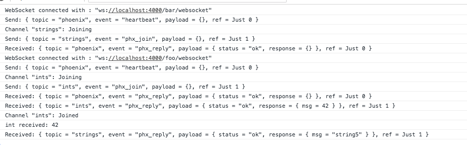
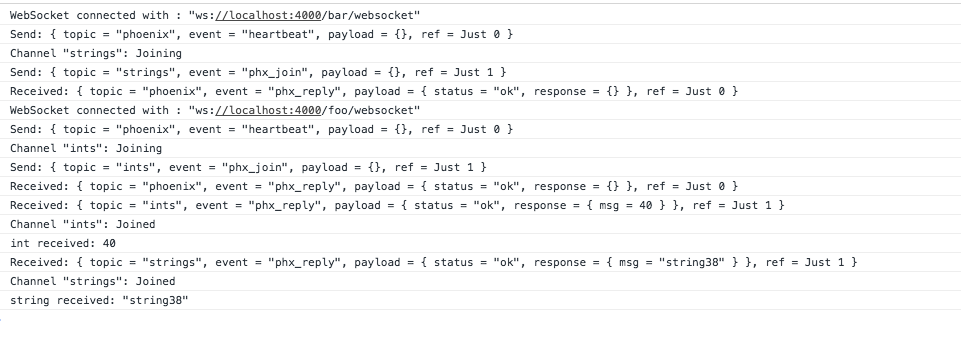

# ElmPhoenixExample

## Broken

Here you can see that the `string received` message is never received since the selfcallback was removed from the event manager state due to the `ref` being the same in both channel joins:

## Fixed

With the fix you can see that both messages are correctly received (`string received`):

